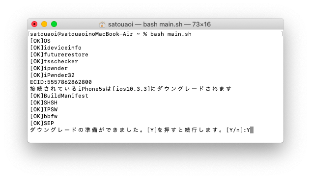

# iDevide-Downgrader-Script

コマンドの知識無しでもっとも簡単にiPhone5s及び iPhone5 をダウングレードするスクリプトです。  
必要なコマンドやファイルはすべてスクリプトが自動で用意します

# 対応デバイス

iPhone4s [iPhone4,1] (現状Jailbreakが必要)  
iPhone5 [iPhone5,2]  
iPhone5s [iPhone6,1]
iPad 第四世代 [iPad3,6]

# 対応OS

Intel_MacOSのみ。BigSur推奨。  (原因は分かりませんがMonterey以上だと正しく動作しません)  
Catalinaで動作検証済み

# 実行する前に

予めMacOSにHomebrewを導入してください。  
導入していない場合は実行中に必要なコマンドを入力するよう指示をすることがあります  
このスクリプトを実行したことによる故障や損害について開発者は責任を負いかねます

# 実行の仕方

通常通り起動するiPhoneをPCに接続し信頼します  

MacOSのターミナルを起動し以下コマンドを貼り付けて実行します  
```sh
bash <(curl -s https://raw.githubusercontent.com/Aoi-Developer/iDevide-Downgrader-Script/main/main.sh)
```
何かしらの問題によりiPhoneを起動できない場合や検出されない場合は引数にデバイス情報を記述することで実行できます  
```sh
bash <(curl -s https://raw.githubusercontent.com/Aoi-Developer/iDevide-Downgrader-Script/main/main.sh) [device MODEL] [ECID]
```

必要なファイルがダウンロードされたら[Y]を押します  

iDeviceをDFUモードにします(4sに限りkDFUAppでpwndfuにする必要あり)  

おーしまい！ 

失敗した場合はMacを再起動して再度実行すると成功率上がります



# Credits

@dora2-iOS  
https://github.com/dora2-iOS/iPwnder32  
https://github.com/dora2-iOS/ipwnder_lite  

@tihmstar  
https://github.com/tihmstar/futurerestore  
https://github.com/tihmstar/tsschecker

@futurerestore
https://github.com/futurerestore/futurerestore
